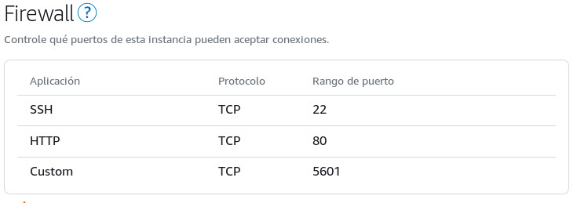

# Setting up Digital Ocean account

We will be working with an [AWS Lightsail instance](https://aws.amazon.com/lightsail/).

Things you need to do:
* [Add your SSH public key to your account](https://lightsail.aws.amazon.com/ls/docs/en_us/articles/understanding-ssh-in-amazon-lightsail)
This is a bit *tricky* because to do so, you should start to create an instance in the web console, and select to upload your SSH public key file. Our default configuration expects that AWS names it `id_rsa`. If you have given it another name, you must change `variable "key_par_name"` in the [main.tf](main.tf) file.
* [Get your AWS access key and secret key](https://lightsail.aws.amazon.com/ls/docs/en_us/articles/lightsail-how-to-set-up-access-keys-to-use-sdk-api-cli).

# Setting your local environment and getting remote machinery ready

1. Change your working directory to `grimoirelab-infra-provision/aws`:
```
cd grimoirelab-infra-provision/aws
```

2. Inside `grimoirelab-infra-provision/aws` create a file called `terraform.tfvars` with the following format and content:
```
AWSAccessKeyId = "<YOUR_AWS_ACCESS_KEY_ID>"
AWSSecretKey = "<YOUR_AWS_SECRET_KEY>"
```

3. Initialize Terraform:
```
terraform init
```

4. Let's create your AWS Ligthsail instance. It will read both your `terraform.tfvars` and `provision.tf` files.
```
terraform apply -var name=<GIVE_IT_A_NAME>
```

During the process, Terraform might ask for confirmation to apply the changes you
have requested. If you want to say `yes` to everything, just run:
```
terraform apply -auto-approve -var name=<GIVE_IT_A_NAME>
```

At the end of the process, Terraform outputs the public IP to access to the
machine you have created. Something like:
```
Apply complete! Resources: 2 added, 0 changed, 0 destroyed.

Outputs:

public_ip = 157.245.85.159
```

**Note**: It seems you cannot open `5601` port needed by Kibana using Terraform 
([terraform-providers/terraform-provider-aws/issues/700](https://github.com/terraform-providers/terraform-provider-aws/issues/700)),
so you'll need to open it using [your AWS Lightsail instances](https://lightsail.aws.amazon.com/ls/webapp/home)
web interface:



You are ready for [next steps](../README.md#step-2-deploy-and-manage-grimoirelab-in-your-cloud-infrastructure)